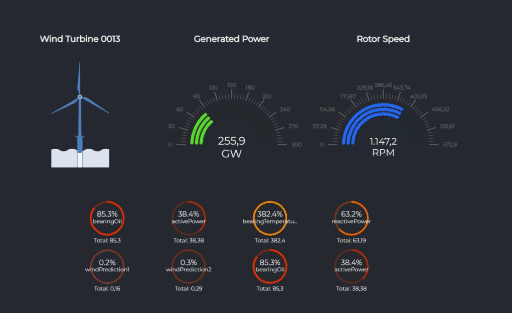
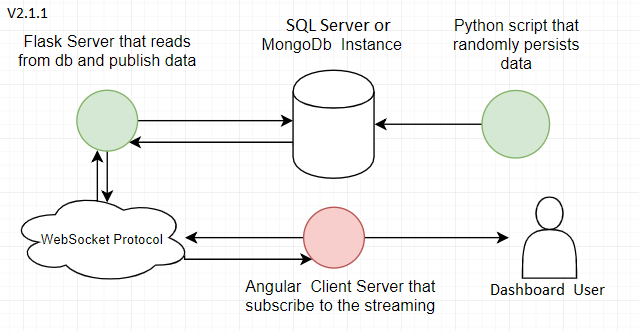

### Wind Power Supervisory System
#### Flask, MongoDB, SQL Server, Angular7, SocketIO -  learning about the interesting https://github.com/swimlane/ngx-charts repository

#
#### System Design

#
#### Steps to run
#
###### Start a local/cloud database (or switch to a db branch)
###### pip install -r requirements.txt
###### python insert_generator.py
###### python app.py
###### npm i
###### npm start

